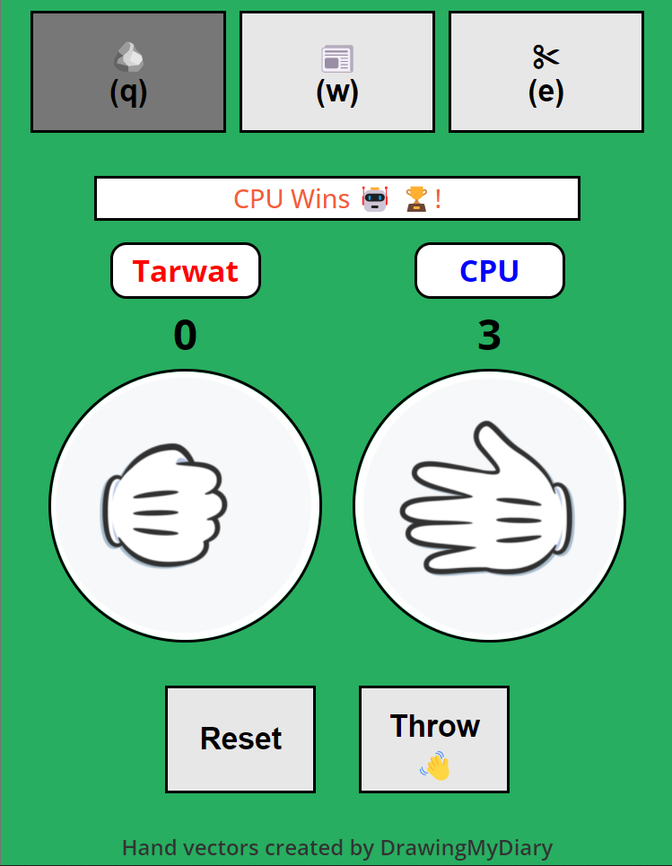
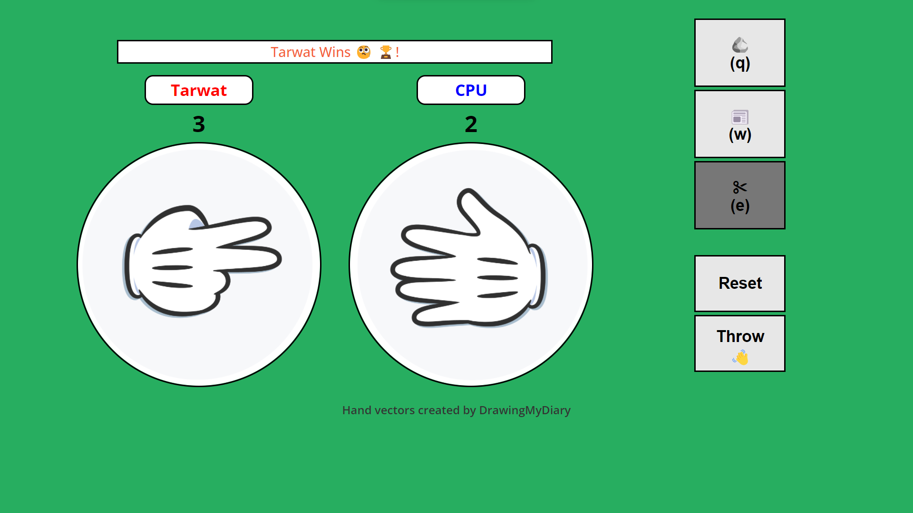
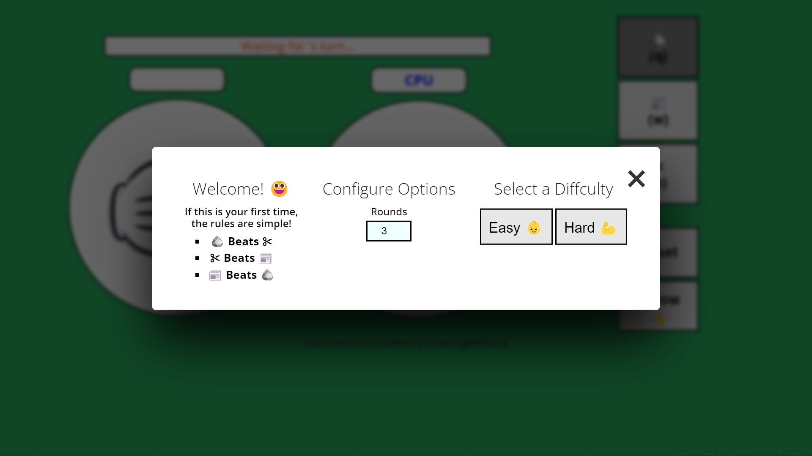

# Roshambo JS

## Screenshots

 

## Description

A JavaScript application based on the Odin Project exercise - **'Rock Paper Scissors'**

**Features:**

- Modern User Interface
- Intuitive Design
- Keyboard Support
- Difficulty Mode Selector
- Round Selector

## What I've Learnt

- Listening to user-created events and handling them appropriately
- Understading event propagation
- Manipulating the DOM - including CSS classes
- Dynamically rendering stored images

## Installation

To use this project, first clone the repo on your device using the command below:

`git init`

`https://github.com/tarwat-uddin/roshambo-js.git`

## License

[GNU General Public License version 3](https://opensource.org/licenses/GPL-3.0)
